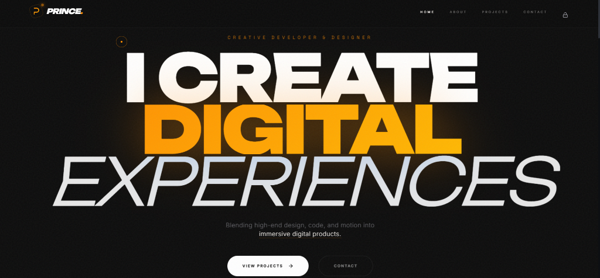
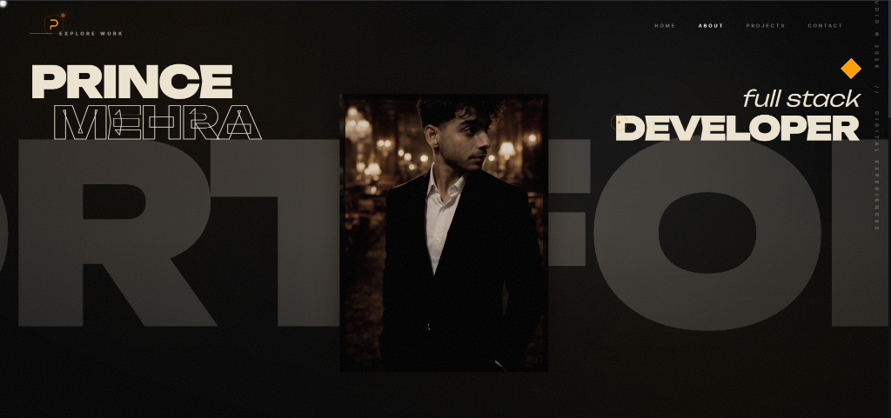
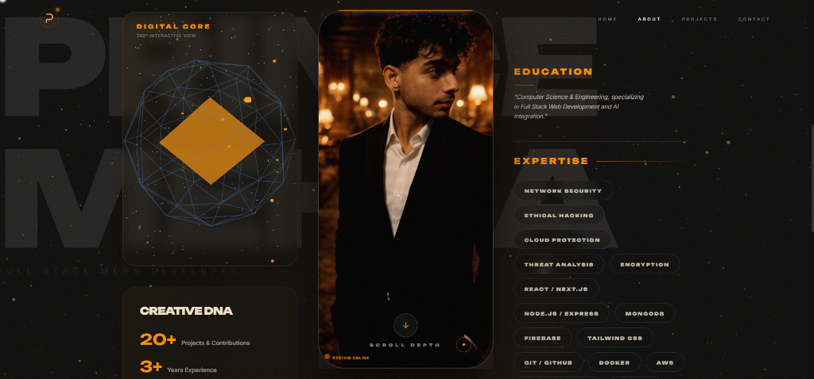
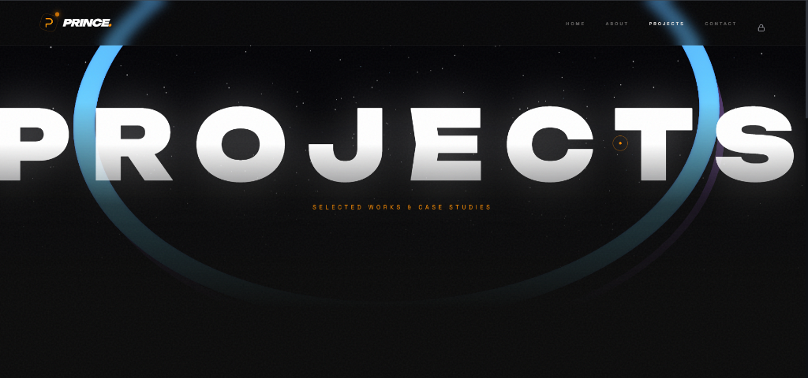
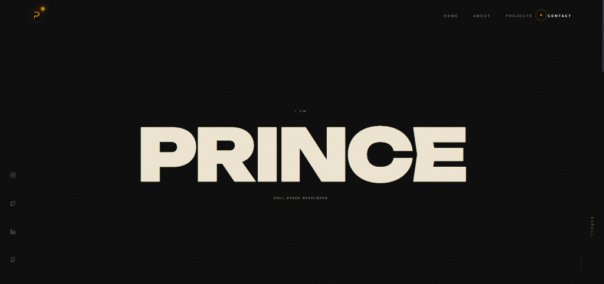

# 🛰️ Prince Mehra | Award-Winning Portfolio



A high-end, immersive digital experience built with a focus on cinematic motion, interactive 3D elements, and premium typography.

## ✨ Key Features

- **🚀 Hyper-3D Visuals:** Interactive "Quantum Core" built with Three.js and custom shaders.
- **🖱️ Mouse Repulsion:** Advanced "mouse avoidance" interaction where UI elements react dynamically to cursor proximity.
- **📸 Personalized Showcase:** Integrated high-quality professional portrait with cyber-scanning effects.
- **🌊 Liquid Motion:** Ultra-smooth scrolling driven by **Lenis** and character-level reveals using **Framer Motion**.
- **🎨 Luxury Aesthetic:** Premium dark theme with obsidian palette, glassmorphism, and cinematic noise textures.

## 🛠️ Tech Stack

- **Framework:** React + TypeScript + Vite
- **3D Engine:** @react-three/fiber + Drei
- **Animations:** GSAP + Framer Motion
- **Styling:** Tailwind CSS + Shadcn UI
- **Smooth Scroll:** Lenis

## 📸 Screenshots

<p align="center">
  
  
</p>
<p align="center">
  
  
</p>

## 🚀 Getting Started

1. **Clone the repository:**
   ```bash
   git clone https://github.com/princemehra9024/PRINCE-portfolioo.git
   ```

2. **Install dependencies:**
   ```bash
   npm install
   ```

3. **Run the development server:**
   ```bash
   npm run dev
   ```

4. **Build for production:**
   ```bash
   npm run build
   ```

---
Built with passion by **Prince Mehra** 🤝✨🚀🛰️✅
